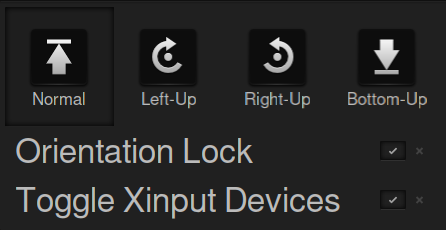

# rotman - Rotation Manager Cinnamon Applet

This cinnamon applet is intended for tablet and convertible users that want to have an easy way of changing screen orientation, orientation lock status, and enabling/disabling of touchpads / trackpoints. At present this is being developed on a Lenovo X1 Yoga.



Rotman allows you to do a couple of things. You can
* rotate your screen and pointing devices by a simple touch of a button
* scale the applet's user interface so it is easier to navigate with a touch device
* automatically disable input devices in tablet-mode (Useful for convertibles like the X1 Yoga where the touchpad ends up at the base of the "tablet" and you don't want to accidentally click somewhere while holding it)
* enable and disable the orientation lock with a simple switch
* use it together with iio-sensor-proxy for auto-rotation goodness


## Prerequisites

Depending on your device you will need a few prerequisites to get this working. The basic manual rotation functions should work everywhere. If you want automatic accelerometer-based rotation, you need [iio-sensor-proxy by hadess](https://github.com/hadess/iio-sensor-proxy). Depending on your distribution, getting it might be as convenient as typing `apt-get install iio-sensor-proxy`. You will of course need the cinnamon desktop environment as this is a cinnamon applet (duh!). 

## Installation
Copy the `rotman@evilphish` folder inside of the `files` directory into your app directory. Depending on your setup this might be one of
```
~/.local/share/cinnamon/applets/
/usr/share/cinnamon/applets/
```

## Known Issues
Probably some... please let me know. Also I would appreciate "works / does not work" reports for tablets / convertibles other than the Lenovo X1 Yoga. 

## Tested on
* Lenovo X1 Yoga (2nd Gen)


